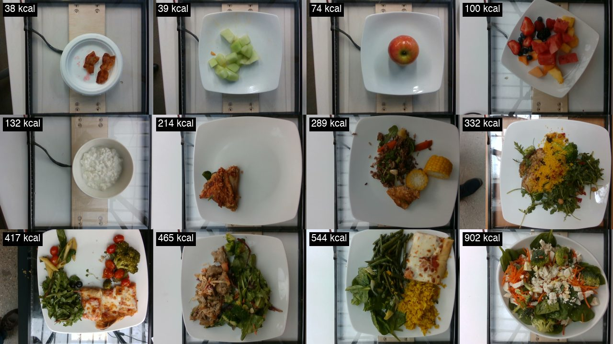

# CalorieBench

How accurately can AI models count the calories in a photo of your food?

**[See the full results, with every plate and every guess →](https://mmiddlezong.github.io/calorie-bench/)**

## Results

<!-- LEADERBOARD:START -->
| Rank | Model | Average error | Within 20% | Tends to guess | Cost per 100 photos |
|:---:|---|---:|---:|---|---:|
| 1 | **Claude Fable 5.1** (Anthropic) | **82** calories (70–96) | 40% | 38 too low | $1.86 |
| 2 | **Claude Opus 5.5** (Anthropic) | **91** calories (79–105) | 34% | 23 too high | $0.88 |
| 3 | **Claude Sonnet 5** (Anthropic) | **101** calories (88–114) | 36% | 20 too high | $0.38 |
| 4 | **GPT-6 Luna** (OpenAI) | **112** calories (98–127) | 27% | 51 too high | $0.05 |
| 5 | **GPT-6 Sol** (OpenAI) | **127** calories (112–142) | 26% | 83 too high | $0.96 |
| 6 | **Claude Haiku 4.5** (Anthropic) | **139** calories (123–156) | 27% | 62 too high | $0.99 |
| 7 | **GPT-6 Astra** (OpenAI) | **145** calories (129–162) | 22% | 118 too high | $5.83 |

Average error is how far a model's estimate was from the true calorie count, averaged over all the plates. The range in parentheses is a 95% confidence interval: when two models' ranges overlap, the difference between them may be luck. "Within 20%" is the share of plates a model got within 20% of the truth. Updated September 25, 2026.
<!-- LEADERBOARD:END -->

## How the test works

We gave each model 200 photos of real meals from a campus cafeteria, one at a time, and
asked how many calories were on the plate. The photos come from
[Nutrition5k](https://github.com/google-research-datasets/Nutrition5k), a research dataset
in which every ingredient was weighed as the plate was put together, so the true calorie
count of each plate is known.

The plates range from half an ear of corn (31 calories) to a plate of pizza, chicken and
pineapple (942 calories). Every model saw the same photos and got the
same instructions.

<p align="center">
  
</p>

## What we found

**Even the best models are often far off.** Claude Fable 5.1 had the lowest average error,
82 calories per plate, but came within 20% of the truth on only 80 of the 200 plates. On
43 plates, no model got within 20%. Fable 5.1 and Claude Opus 5.5 (91 calories) are close
enough that the gap between them could be luck.

**Claude models underestimate big meals; GPT-6 models overestimate.** On plates over 500
calories, every Claude model guessed far too low, Claude Fable 5.1 by 209 calories on
average. The GPT-6 models leaned the other way: all three guessed too high on average, and
GPT-6 Astra by 118 calories per plate.

**Price is a poor guide to accuracy.** GPT-6 Luna costs 5 cents per 100 photos and beat
GPT-6 Astra, which costs more than 100 times as much.

If you use an app that estimates calories from photos, treat its number as a rough
starting point, especially for large or mixed plates.

## Limits

Two hundred plates is enough to tell the best models from the worst, but not to separate
models within about 10 calories of each other. The ranges in the table show how much
uncertainty there is.
All of the food comes from one cafeteria in 2019 and is mostly Western-style, every photo
was taken from directly above, and nothing in the frame shows scale. The true calorie counts come from
weighed ingredients and standard nutrition tables, not laboratory tests.

## Run it yourself

CalorieBench is open source. You need [uv](https://docs.astral.sh/uv/) and API keys for
the models you want to test.

```bash
git clone https://github.com/mmiddlezong/calorie-bench && cd calorie-bench
uv sync
uv run caloriebench download            # the 200 photos, about 79 MB
cp .env.example .env                    # then add your API keys
uv run caloriebench estimate anthropic  # see what a run will cost before paying for it
uv run caloriebench run anthropic
uv run caloriebench score               # updates the results table above
```

Running all four Claude models on the 200 photos cost about $8. How the plates were chosen, the exact
prompt, the scoring rules, cost estimates for every model, and how to add a new one are
in [docs/methodology.md](docs/methodology.md).

## Credits

Photos and nutrition data are from Nutrition5k (Thames et al., CVPR 2021), released by
Google under CC BY 4.0. The code is MIT licensed.
